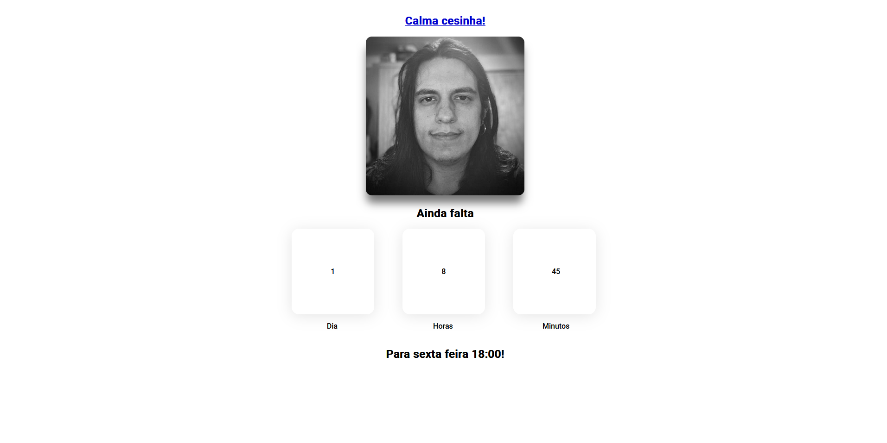

# Calma Cesinha!
[](https://app.netlify.com/sites/calma-cesinha/deploys)

**Projeto feito para o cesinha saber quanto tempo falta para sexta feira 18:00!**

---

## [Preview do site](https://calma-cesinha.netlify.app/)



## Tecnologias 💻
* React.js
* Netlify

## Clonando o repositório 👯‍♀️

HTTPS
```bash
git clone https://github.com/ASGARDU/calma-cesinha.git 
```

SSH
```bash
git clone git@github.com:ASGARDU/calma-cesinha.git 
```

[Github CLI](https://cli.github.com/)
```bash
gh repo clone ASGARDU/calma-cesinha
```

## Rodando localmente o projeto 🏃‍♂️💨
```bash
cd calma-cesinha
yarn
yarn dev
```


Autores: ASGARDU TEAM